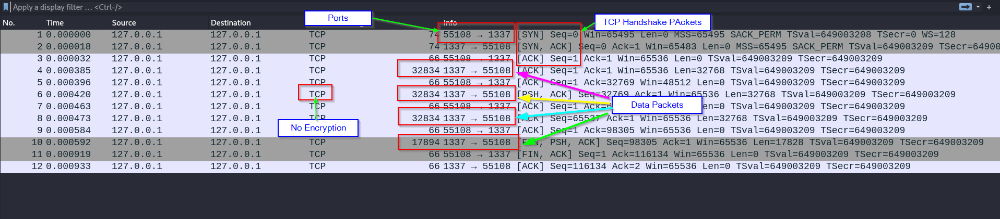
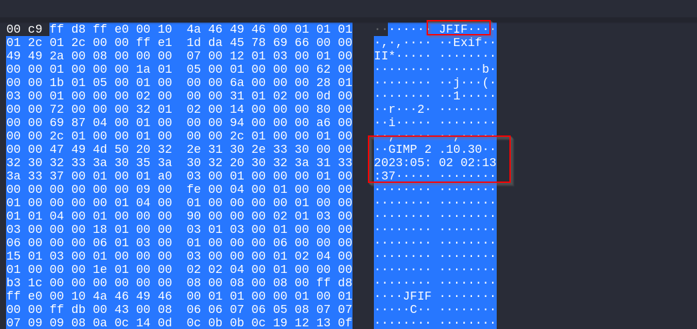

> Raj Pastagiya | 06/05/2023

# Identifying Useful Data
- Open the pcap file in wireshark, and you will see TCP requests flowing between localhost:1337 and localhost:55108.
- Some clearly noticable things as shown in figure:
	- First 3 packets are TCP handshake (So no data will be there generally)
	- There is no encryption protocol enabled, so all data transferred must be in clear text.
	- 4th, 6th, 8th packets have size 32834 bytes, which is most likely the data packets.
	- As there are 3 packets with same size we need to consider 2 possibilities:
		1. Same data is being transferred 3 times
		2. A single data file is broken into 3 segments and sent using TCP packets. (Segmentation is most likely the case here)
	- There is also one more data packet with apperently less data size.


- Here now if we check the first packet, the ASCII text form of the data packet shows text like "JFIF", "GIMP 2.10.30", etc., which clearly suggests image file has been sent via this packet.


- As we now know this is image file, the type of file can be found out by the first 4-8 bytes of the "Data" part of the packet which contains the data, which are "ffd8ffe000104a..." and if we find these bytes in the list of signatures or "Magic Bytes" [HERE](https://en.wikipedia.org/wiki/List_of_file_signatures#:~:text=This%20is%20a%20list%20of,magic%20numbers%20or%20Magic%20Bytes.), we see that it is of JPG file.
- Now we need to get the data value which we can get using **"Right Click on Data" -> Copy -> Value** and then store it in a file let's say "hexFile.txt". (Copied text will be of Hex form).
- Below is the python sctript which can get the hex stream from the file and store raw bytes in image.jpg using binascii library.
```python
#!/usr/bin/python3

import binascii

with open('image.jpg', 'wb') as image_file:
    image_file.write(binascii.a2b_hex(open('hexFile.txt', 'r').read().strip().replace(' ', '').replace('\n', '')))
```
- Once we run the code, an image.jpg file is created and if we see it using image viewer, it is too much blurry. Now this is a typical case when segmentation is done by TCP.
- So now we just need to grab the data values of other 3 packets and append it into "hexFile.txt" and run the python script again, which will give us a clearer image file.

***FLAG:** "CSeC{if_you_had_fought_like_a_man_you_need_not_have_been_hang'd_like_a_dog}"*
